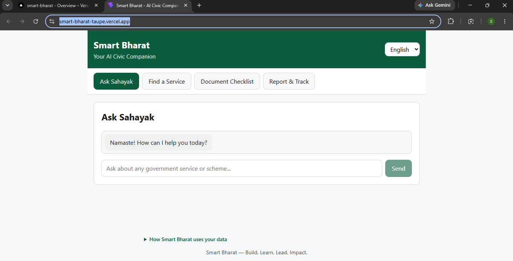
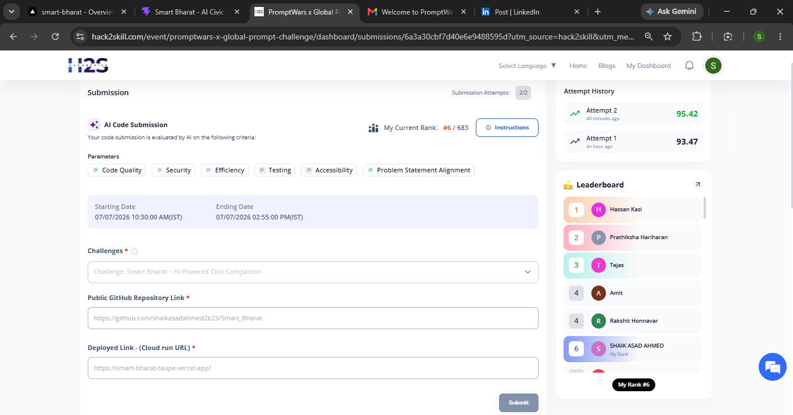
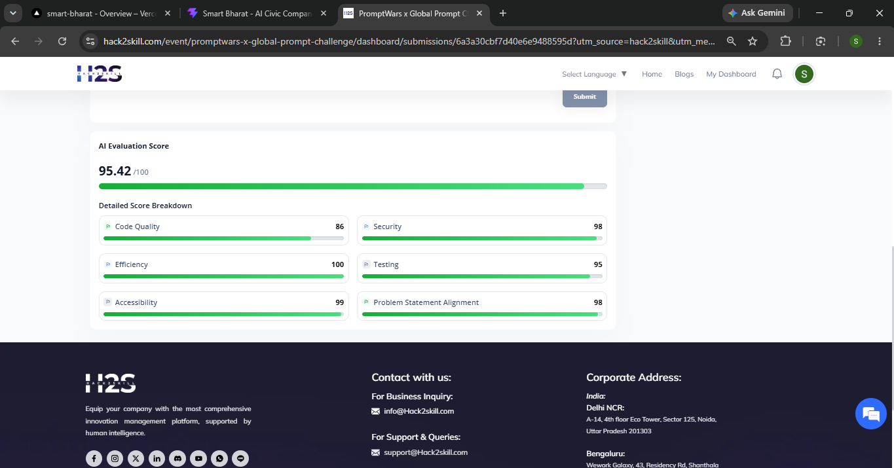

<div align="center">

# 🇮🇳 Smart Bharat — AI-Powered Civic Companion

**Your GenAI companion for accessing government services, understanding requirements, and reporting civic issues — in your own language.**

[](https://smart-bharat-taupe.vercel.app/)
[](https://github.com/shaikasadahmed2k23/Smart_Bharat)
[](https://github.com/shaikasadahmed2k23/Smart_Bharat)


**Built for:** PromptWars x Global Prompt Challenge — organized by DEVENGERS in collaboration with Hack2Skill & Google for Developers
**🏆 Rank #6 / 683 · Score: 95.42/100**

[🚀 Live Demo](https://smart-bharat-taupe.vercel.app/) · [📦 GitHub Repo](https://github.com/shaikasadahmed2k23/Smart_Bharat)

</div>

---

## 📋 Table of Contents
- [Overview](#-overview)
- [Screenshots](#-screenshots)
- [Features](#-features)
- [Architecture](#-architecture)
- [API Reference](#-api-reference)
- [Design Decisions](#-design-decisions)
- [Local Setup](#-local-setup)
- [Testing](#-testing)
- [Deployment](#-deployment)
- [Tech Stack](#-tech-stack)
- [Evaluation Breakdown](#-evaluation-breakdown)
- [Roadmap](#-roadmap)

---

## 🎯 Overview

**Problem Statement:** Build a GenAI-powered web platform that helps citizens access government services, report public issues, and receive personalized assistance through an intelligent AI companion — with multilingual support, transparency, and accessibility at the core.

Smart Bharat answers this with a hybrid architecture: a **deterministic data catalog** for facts that must never be wrong (which documents you need, which scheme fits your query), and **Gemini 2.5 Flash** for open-ended natural-language conversation — giving citizens both accuracy and a genuinely helpful AI companion.

---

## 📸 Screenshots

<div align="center">
  
</div>

<br/>

<div align="center">
  <table>
    <tr>
      <td width="50%" align="center">
        
      </td>
      <td width="50%" align="center">
        
      </td>
    </tr>
  </table>
</div>

> Place your three screenshots inside a `/screenshots` folder at the repo root, named `screenshot1.png`, `screenshot2.png`, and `screenshot3.png` (or update the `src` paths above to match your actual filenames). `screenshot1` renders full-width; `screenshot2` and `screenshot3` render side by side at 50% width each.

---

## ✨ Features

| Feature | Description |
|---|---|
| 🤖 **Ask Sahayak** (AI Chat) | Gemini-powered assistant that answers citizen questions about government schemes, procedures, and civic issues in plain language, in the user's chosen language. |
| 🔍 **Find a Service** | Keyword-matched recommendation engine over a curated catalog of common Indian public services (Aadhaar, PAN, Ration Card, Ayushman Bharat, PM-Kisan, Passport, Voter ID, etc.) |
| 📋 **Document Checklist** | Instantly look up exactly which documents are needed for a given service, plus a link to the official portal. |
| 📝 **Report & Track** | File civic complaints (roads, water, electricity, sanitation...) and track status through `submitted → in_review → resolved`. |
| 🌐 **Multilingual UI** | Full interface + AI responses available in **English, Hindi, and Telugu**. |
| ♿ **Accessibility** | Semantic HTML, ARIA live regions for chat, skip-to-content link, 44px minimum touch targets, visible focus rings, reduced-motion support, high-contrast color palette. |

---

## 🏗️ Architecture

```
smart-bharat/
├── screenshots/             App screenshots for README
├── backend/                 FastAPI + SQLite + Gemini
│   ├── main.py                API routes, middleware, rate limiting
│   ├── middleware.py           Rate-limiting & security headers
│   ├── models.py               Pydantic schemas + validation
│   ├── database.py             SQLite connection/init
│   ├── civic_data.py           Curated services + document catalog
│   ├── gemini_client.py        Gemini wrapper (google-genai SDK)
│   └── test_main.py            Pytest suite (8 tests)
└── frontend/                 React (Vite)
    ├── src/App.jsx             Tab navigation + language switcher
    ├── src/i18n.js             EN/HI/TE translation strings
    ├── src/api.js              Typed fetch wrapper
    └── src/components/         ChatCompanion, ServiceFinder,
                                DocumentChecklist, ComplaintTracker
```

**Data flow:** Frontend (React) → REST calls via `api.js` → FastAPI routes → either the deterministic `civic_data.py` catalog (services/documents) or `gemini_client.py` (open-ended chat) → SQLite for complaint persistence.

---

## 🔌 API Reference

| Method | Endpoint | Description |
|---|---|---|
| `GET` | `/health` | Health check |
| `POST` | `/api/chat` | Ask Sahayak — Gemini-powered Q&A |
| `POST` | `/api/services/recommend` | Keyword-matched service recommendations |
| `POST` | `/api/documents/requirements` | Document checklist for a given service |
| `POST` | `/api/complaints` | File a new civic complaint |
| `GET` | `/api/complaints` | List complaints (paginated via `limit`) |
| `GET` | `/api/complaints/{complaint_id}` | Get a single complaint |
| `PATCH` | `/api/complaints/{complaint_id}` | Update complaint status |

All endpoints are protected by IP-based rate limiting and return structured error responses via a global exception handler.

---

## 🧠 Design Decisions

- **Deterministic core, GenAI where it adds value.** Service recommendation and document requirements are backed by a structured, testable data catalog rather than pure LLM guesswork — this avoids hallucination on facts like "which documents do I need," while Gemini is reserved for open-ended citizen queries where natural language understanding genuinely helps.
- **System prompt design.** The Gemini system instruction explicitly tells the model to (a) never request sensitive personal data, (b) admit uncertainty and redirect to official portals rather than guess, and (c) reply only in the requested language — directly serving the transparency and multilingual requirements of the problem statement.
- **Security.** CORS is restricted via env var, all inputs are validated with Pydantic (length limits, language whitelist, status enum), API key is never hardcoded (loaded from `.env`), and all SQL uses parameterized queries only.
- **Accessibility-first frontend.** Built with ARIA roles, semantic landmarks, keyboard-navigable tabs, and a skip link from the start rather than retrofitted.
- **Async I/O + caching.** Route handlers doing DB or Gemini calls are async; static catalog lookups are LRU-cached; DB indexes speed up complaint filtering.

---

## 💻 Local Setup

### Backend
```bash
cd backend
pip install -r requirements.txt
cp .env.example .env   # add your GEMINI_API_KEY
uvicorn main:app --reload
```

### Frontend
```bash
cd frontend
npm install
cp .env.example .env   # set VITE_API_BASE_URL if backend isn't on localhost:8000
npm run dev
```

---

## ✅ Testing

```bash
cd backend
pytest test_main.py -v
```

8 tests covering chat, service recommendation, document lookup, and complaint CRUD.

---

## 🚢 Deployment

| Layer | Platform | Env vars |
|---|---|---|
| Backend | Render / Railway | `GEMINI_API_KEY`, `ALLOWED_ORIGINS` |
| Frontend | Vercel / Netlify | `VITE_API_BASE_URL` (deployed backend URL) |

**Live app:** https://smart-bharat-taupe.vercel.app/

---

## 🛠️ Tech Stack

**Backend:** FastAPI · SQLite · Gemini 2.5 Flash (`google-genai` SDK) · Pydantic
**Frontend:** React 19 · Vite

---

## 📊 Evaluation Breakdown

| Criteria | Score |
|---|---|
| Overall | **95.42 / 100** |
| Efficiency | 100 |
| Accessibility | 99 |
| Problem Statement Alignment | 98 |
| Security | 98 |
| Testing | 95 |
| Code Quality | 86 |

---

## 🗺️ Roadmap

- [ ] Push Code Quality further — reduce duplication, expand docstring/type-hint coverage
- [ ] More granular test coverage on edge-case inputs
- [ ] Expand language support beyond English/Hindi/Telugu
- [ ] Add offline-first PWA support for low-connectivity areas
